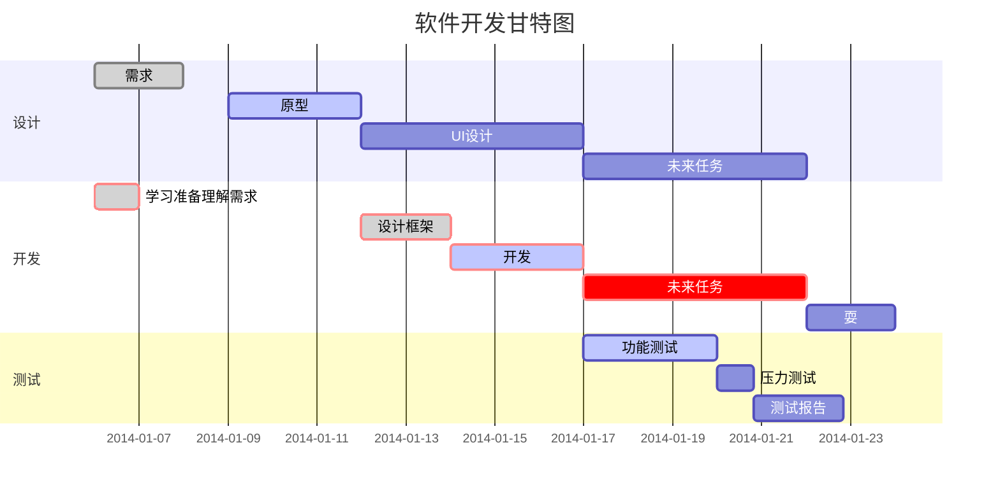
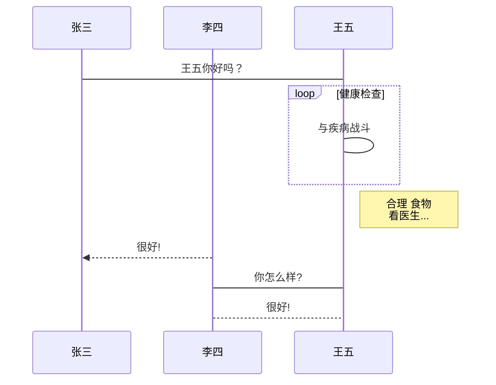

# Mardown使用

## **标题的使用**

>====== 放在下一行表示标题   -------放在下一行表示二级标题

一级标题
======================

二级标题
--------------
> #表示标题级别  1，2，3，4，5，6

## 段落格式

文字尾部添加两个空格表示换行  

## 字体

```markdown
\*斜体文本\*
_斜体文本_
**粗体文本**
\_\_粗体文本\_\_
***粗斜体文本***
___粗斜体文本___
```

## 分割线

----------------------

> 连续的 * -  来建立一行分隔线

## 删除线

> 前后加上两个~~
>
> ```markdown
> ~~删除线~~	
> ```

## 下划线

```html
<u>下划线</u>
```

## 脚注

Markdown 脚注的格式如下:

```
[^要注明的文本]
```

以下实例演示了脚注的用法：

```markdown
创建脚注格式类似这样 [^RUNOOB]。

[^RUNOOB]: 菜鸟教程 -- 学的不仅是技术，更是梦想！！！
```

[^脚注]:脚步注明

## 列表

> (*)(-)(+) 表示无序列表

* 有序列表

* 无需列表

1. 有序列表1
2. 有序列表2
    * 嵌套列表
    * 嵌套列表 :derelict_house:

## 区块
> 区块
> > 区块嵌套
> > > 区块再嵌套
> > > - 列表
> > > - 列表
- 列表
  
    > 区块
>
## 代码
`printf()`
``` this is a java block 
pubilc void main(String[] args)
```
## 链接

链接使用方法如下：

```
[链接名称](链接地址)

或者

<链接地址>
```

例如：

```markdown
这是一个链接 [菜鸟教程](https://www.runoob.com)
```
[菜鸟教程](https://www.runoob.com)

```markdown
这个链接用 1 作为网址变量 [Google][1]
这个链接用 runoob 作为网址变量 [Runoob][runoob]
然后在文档的结尾为变量赋值（网址）

  [1]: http://www.google.com/
  [runoob]: http://www.runoob.com/
```

## 图片


## 表格

| 左对齐 | 右对齐 | 居中对齐 |
| :-----| ----: | :----: |
| 单元格 | 单元格 | 单元格 |
| 单元格 | 单元格 | 单元格 |

```flow
st=>start: 开始框
op=>operation: 处理框
cond=>condition: 判断框(是或否?)
sub1=>subroutine: 子流程
io=>inputoutput: 输入输出框
e=>end: 结束框
st->op->cond
cond(yes)->io->e
cond(no)->sub1(right)->op
```



