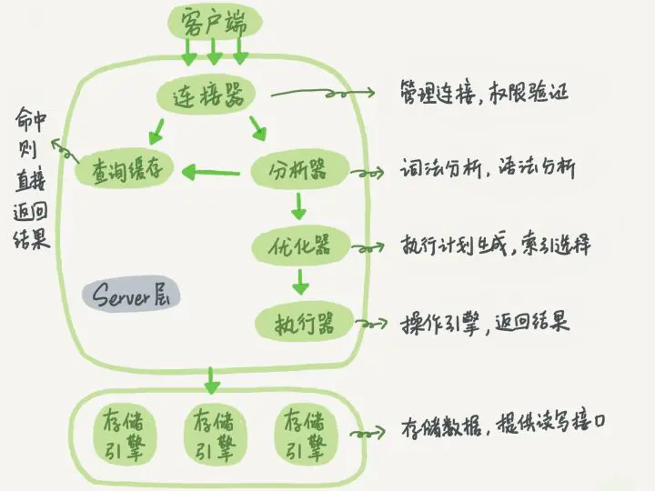
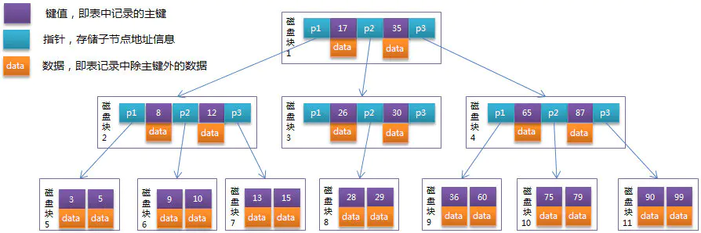
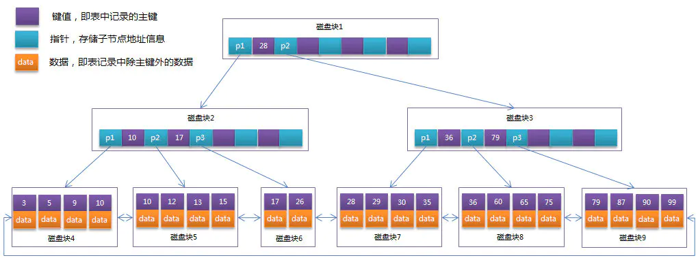

# mysql
## 结构
1. 连接层：最上层是一些客户端和连接服务。主要完成一些类似于连接处理、授权认证、及相关的安全方案。在该层上引入了线程池的概念，为通过认证安全接入的客户端提供线程。同样在该层上可以实现基于SSL的安全链接。服务器也会为安全接入的每个客户端验证它所具有的操作权限。
2. 服务层：第二层服务层，主要完成大部分的核心服务功能， 包括查询解析、分析、优化、缓存、以及所有的内置函数，所有跨存储引擎的功能也都在这一层实现，包括触发器、存储过程、视图等
3. 引擎层：第三层存储引擎层，存储引擎真正的负责了MySQL中数据的存储和提取，服务器通过API与存储引擎进行通信。不同的存储引擎具有的功能不同，这样我们可以根据自己的实际需要进行选取
4. 存储层：第四层为数据存储层，主要是将数据存储在运行于该设备的文件系统之上，并完成与存储引擎的交互

## 执行流程
1. 客户端请求
2. 连接器接受请求 验证身份，授权
3. 查询缓存
4. 分析器 sql解析 语法分析 词法分析
5. 优化器 对sql选择最优执行方案
6. 执行器 ACL
7. 引擎层查询数据
  

## 存储引擎
1. 可插拔的存储引擎体系结构
```
-- 查看支持的存储引擎
SHOW ENGINES

-- 查看默认存储引擎
SHOW VARIABLES LIKE 'storage_engine'

--查看具体某一个表所使用的存储引擎，这个默认存储引擎被修改了！
show create table tablename

--准确查看某个数据库中的某一表所使用的存储引擎
show table status like 'tablename'
show table status from database where name="tablename"

-- 建表时指定存储引擎。默认的就是INNODB，不需要设置
CREATE TABLE t1 (i INT) ENGINE = INNODB;
CREATE TABLE t2 (i INT) ENGINE = CSV;
CREATE TABLE t3 (i INT) ENGINE = MEMORY;

-- 修改存储引擎
ALTER TABLE t ENGINE = InnoDB;

-- 修改默认存储引擎，也可以在配置文件my.cnf中修改默认引擎
SET default_storage_engine=NDBCLUSTER;

```
2. 常见存储引擎  
    - innodb
    - myisam
    - memory

3. 文件存储结构对比
  > 在 MySQL中建立任何一张数据表，在其数据目录对应的数据库目录下都有对应表的 .frm 文件，.frm 文件是用来保存每个数据表的元数据(meta)信息，包括表结构的定义等，与数据库存储引擎无关，也就是任何存储引擎的数据表都必须有.frm文件，命名方式为 数据表名.frm，如user.frm。
  查看MySQL 数据保存在哪里：show variables like 'data%'  
    MyISAM 物理文件结构为：
    .frm文件：与表相关的元数据信息都存放在frm文件，包括表结构的定义信息等
    .MYD (MYData) 文件：MyISAM 存储引擎专用，用于存储MyISAM 表的数据
    .MYI (MYIndex)文件：MyISAM 存储引擎专用，用于存储MyISAM 表的索引相关信      息
    InnoDB 物理文件结构为：
    .frm 文件：与表相关的元数据信息都存放在frm文件，包括表结构的定义信息等
    .ibd 文件或 .ibdata 文件： 这两种文件都是存放 InnoDB 数据的文件，之所以     有两种文件形式存放 InnoDB 的数据，是因为 InnoDB 的数据存储方式能够通过配   置来决定是使用共享表空间存放存储数据，还是用独享表空间存放存储数据。
    独享表空间存储方式使用.ibd文件，并且每个表一个.ibd文件
    共享表空间存储方式使用.ibdata文件，所有表共同使用一个.ibdata文件（或多      个，可自己配置）

    - innoDb支持事务，myisam不支持
    - innodb有表锁也有行锁，myisam只有表锁，并发场景下性能不够
    - innodb支持外建，myisam不支持
    - innodb是聚簇索引，myisam是非聚簇索引
        > 聚簇索引的文件存放在主键索引的叶子节点上，因此 InnoDB 必须要有主键，通过主键索引效率很高。但是辅助索引需要两次查询，先查询到主键，然后再通过主键查询到数据。因此，主键不应该过大，因为主键太大，其他索引也都会很大。而 MyISAM 是非聚集索引，数据文件是分离的，索引保存的是数据文件的指针。主键索引和辅助索引是独立的。
    - innodb不保存表具体的行数，myisam用了一个变量来维护
        > 为什么 InnoDB 引擎不像 MyISAM 引擎一样，将总行数存储到磁盘上？这跟 InnoDB 的事务特性有关，由于多版本并发控制（MVCC）的原因，InnoDB 表“应该返回多少行”也是不确定的。
    - 一张表，里面有ID自增主键，当insert了17条记录之后，删除了第15,16,17条记录，再把Mysql重启，再insert一条记录，这条记录的ID是18还是15？
        > 如果表的类型是MyISAM，那么是18。因为MyISAM表会把自增主键的最大ID 记录到数据文件中，重启MySQL自增主键的最大ID也不会丢失；
          如果表的类型是InnoDB，那么是15。因为InnoDB 表只是把自增主键的最大ID记录到内存中，所以重启数据库或对表进行OPTION操作，都会导致最大ID丢失。

## 数据类型
   1. varchar 和char的区别
        - varchar只是确认最大长度，char直接分配对应空间
        - 存储最大长度不一样， 一个255 一个65537 
        - char存储截断尾部的空格 varchar不会
        - 超过长度都会截断

## 索引
1. 对索引的理解
    > 帮助mysql高效查询数据的数据结构 提高查询效率
    > 以文件形式存储在磁盘上
    > 优点 提高查询效率 缺点 提高储存的时间成本，空间成本
2. 索引分类
    -  B+树索引 B树索引 Full-text R-tree索引  
    -  聚簇索引 非聚簇索引（辅助索引）
    -  主键索引 普通索引 复合索引 唯一索引 空间索引

3. B && B+ Tree
    - B树是为磁盘等外部存储设备设计的一种平衡查找树。
    - 系统从磁盘读取数据到内存是以磁盘块（block）为单位的，位于同一个block的数据会被一次性读取出来。而不是需要什么读取什么
    - innodb有页的概念，页是磁盘管理的最小单位，innodb存储引擎种默认每个页的大小为16KB，而系统磁盘一个block的大小往往没这么大，所以每次innodb读取磁盘数据都会是连续的磁盘块来达到页的大小16KB。innodb在把磁盘数据读入到磁盘时会以页为单位，在查询数据时如果一个页中的每条数据都能有助于定位数据记录的位置，这将减小io次数，提高查询效率
    - B树的结构可以让系统高效的找到数据所在的磁盘块。为了描述b树，首先定一个一个记录为一个二元组[key, data] ,key是记录的键值，对应一条数据的主键，data为一行记录中除主键外数据。对于不同的记录，key值各不相同。
    - 一棵m阶B树有以下特性
        > 每个节点最多有m个孩子  
        > 除了根节点和叶子结点外，其它每个节点至少有Ceil(m/2)个孩子  
        > 若根节点不是叶子结点，则至少有两个孩子  
        > 所有叶子结点都在同一层，且不包含其它关键字信息  
        > 每个非终端节点包含n个关键字信息（P0,P1,…Pn, k1,…kn）    
        > n满足ceil(m/2) -1 <= n <= m-1  
        > ki(i=1,…n)为关键字，且关键字升序排序  
        > Pi(i=1,…n)为指向子树根节点的指针。P(i-1)指向的子树的所有节点关键字均小于ki，但都大于k(i-1)    
        > B树每个节点根据实际情况可以包含大量的关键字信息和分支，如图    
        > 每个节点占用一个盘块的磁盘空间，一个节点上有两个升序排序的关键字和三个指向子树根节点的指针，指针存储的是子节点所在磁盘块的地址。两个关键词划分成的三个范围域对应三个指针指向的子树的数据的范围域。以根节点为例，关键字为17和35，P1指针指向的子树的数据范围为小于17，P2指针指向的子树的数据范围为17~35，P3指针指向的子树的数据范围为大于35。

    - B+ 树是在B树上的一种优化，B树在每个节点，不光存储数据的key还有data，一个页能存储的key就变少了，数据太多，就导致深度太深，I/O次数多，所以B+tree，把所有的data都按照key的顺序放在同一层的叶子结点上，非叶子节点只存储key的信息，这样子每个节点可以存储的key数量，降低树的高度
        > 与B树的不同:非叶子结点只存储key 所有非叶子节点都有一个链指针 数据都在叶子节点     
    - 通常在B+tree上有两个头指针,一个指向根节点,另一个指向关键字最小的叶子节点,而且所有的叶子结点之间是一种链式结构.因此可以对B+tree进行两种查找,一种是对于主键的范围查找和分页查找,另一种是从跟节点开始,随机查找

    - InnoDB存储引擎中页的大小为16KB，一般表的主键类型为INT（占用4个字节）或BIGINT（占用8个字节），指针类型也一般为4或8个字节，也就是说一个页（B+Tree中的一个节点）中大概存储16KB/(8B+8B)=1K个键值（因为是估值，为方便计算，这里的K取值为10^3）。也就是说一个深度为3的B+Tree索引可以维护10^3 * 10^3 * 10^3 = 10亿 条记录。而B树因为数据也在非叶子结点上,就没法保证这么多记录
    实际情况中每个节点可能不能填充满，因此在数据库中，B+Tree的高度一般都在2-4层。MySQL的InnoDB存储引擎在设计时是将根节点常驻内存的，也就是说查找某一键值的行记录时最多只需要1~3次磁盘I/O操作。

    - 通过上面的分析，我们知道IO次数取决于b+数的高度h，假设当前数据表的数据为N，每个磁盘块的数据项的数量是m，则有h=㏒(m+1)N，当数据量N一定的情况下，m越大，h越小；而m = 磁盘块的大小 / 数据项的大小，磁盘块的大小也就是一个数据页的大小，是固定的，如果数据项占的空间越小，数据项的数量越多，树的高度越低。这就是为什么每个数据项，即索引字段要尽量的小，比如int占4字节，要比bigint8字节少一半。这也是为什么b+树要求把真实的数据放到叶子节点而不是内层节点，一旦放到内层节点，磁盘块的数据项会大幅度下降，导致树增高。当数据项等于1时将会退化成线性表。

    - 当b+树的数据项是复合的数据结构，比如(name,age,sex)的时候，b+数是按照从左到右的顺序来建立搜索树的，比如当(张三,20,F)这样的数据来检索的时候，b+树会优先比较name来确定下一步的所搜方向，如果name相同再依次比较age和sex，最后得到检索的数据；但当(20,F)这样的没有name的数据来的时候，b+树就不知道下一步该查哪个节点，因为建立搜索树的时候name就是第一个比较因子，必须要先根据name来搜索才能知道下一步去哪里查询。比如当(张三,F)这样的数据来检索时，b+树可以用name来指定搜索方向，但下一个字段age的缺失，所以只能把名字等于张三的数据都找到，然后再匹配性别是F的数据了， 这个是非常重要的性质，即索引的最左匹配特性。

    - myisam
        > MyISAM主键索引与辅助索引的结构
            MyISAM引擎的索引文件和数据文件是分离的。MyISAM引擎索引结构的叶子节点的数据域，存放的并不是实际的数据记录，而是数据记录的地址。索引文件与数据文件分离，这样的索引称为"非聚簇索引"。MyISAM的主索引与辅助索引区别并不大，只是主键索引不能有重复的关键字。
    - innodb
        > InnoDB引擎索引结构的叶子节点的数据域，存放的就是实际的数据记录（对于主索引，此处会存放表中所有的数据记录；对于辅助索引此处会引用主键，检索的时候通过主键到主键索引中找到对应数据行），或者说，InnoDB的数据文件本身就是主键索引文件，这样的索引被称为"“聚簇索引”，一个表只能有一个聚簇索引。
    - 为什么用整型自增主键 而不是uuid
        > 节约空间
        > 查找时会进行key值比较,整型效率更高
        > 自增的整形索引在磁盘中会连续存储,在读取一页数据时也会连续,UUID随机产生,读取上下两行的数据存储是分散的,不适合执行  where id > 5 && id < 20的条件查询语句
        > 在插入或删除数据时,整型自增主键会在叶子节点的末尾建立新的叶子结点,不会破坏左侧子树的结构,UUID很容易出现这种情况,B+树为了维护自身特性,可能会进行结构的重构,消耗更多的时间
    - 为什么索引树存储的是主键索引
        > 保持数据一致性 和节约存储空间
    - 为什么用B树,不是B+树
        > 用B+树不用B树考虑的是IO对性能的影响，B树的每个节点都存储数据，而B+树只有叶子节点才存储数据，所以查找相同数据量的情况下，B树的高度更高，IO更频繁。数据库索引是存储在磁盘上的，当数据量大时，就不能把整个索引全部加载到内存了，只能逐一加载每一个磁盘页（对应索引树的节点）。其中在MySQL底层对B+树进行进一步优化：在叶子节点中是双向链表，且在链表的头结点和尾节点也是循环指向的。
    - 为什么不用hash索引 
        > 因为Hash索引底层是哈希表，哈希表是一种以key-value存储数据的结构，所以多个数据在存储关系上是完全没有任何顺序关系的，所以，对于区间查询是无法直接通过索引查询的，就需要全表扫描。所以，哈希索引只适用于等值查询的场景。而B+ Tree是一种多路平衡查询树，所以他的节点是天然有序的（左子节点小于父节点、父节点小于右子节点），所以对于范围查询的时候不需要做全表扫描。哈希索引不支持多列联合索引的最左匹配规则，如果有大量重复键值得情况下，哈希索引的效率会很低，因为存在哈希碰撞问题。
    - 什么时候需要索引
        > 主键自动算一个索引
        > 频繁成为查询条件的字段
        > 查询与其他表关联的字段,外建关系建立索引
        > 单键/组合索引的选择问题，高并发下倾向创建组合索引
        > 查询中排序字段,通过索引提高排序速度
        > 查询中统计或者分组字段
    - 什么时候不建议创建索引
        > 表记录太少
        > 经常增删改的表(维护索引成本大)
        > 数据重复且分布均匀的表字段，只应该为最经常查询和最经常排序的数据列建立索引（如果某个数据类包含太多的重复数据，建立索引没有太大意义）
        > where条件里用不到的字段不创建索引
    - mysql高效索引
        > 覆盖索引（Covering Index）,或者叫索引覆盖， 也就是平时所说的不需要回表操作
        > 就是select的数据列只用从索引中就能够取得，不必读取数据行，MySQL可以利用索引返回select列表中的字段，而不必根据索引再次读取数据文件，换句话说查询列要被所建的索引覆盖
        > 索引是高效找到行的一个方法，但是一般数据库也能使用索引找到一个列的数据，因此它不必读取整个行。毕竟索引叶子节点存储了它们索引的数据，当能通过读取索引就可以得到想要的数据，那就不需要读取行了。一个索引包含（覆盖）满足查询结果的数据就叫做覆盖索引
        > 使用explain，可以通过输出的extra列来判断，对于一个索引覆盖查询，显示为using index，MySQL查询优化器在执行查询前会决定是否有索引覆盖查询
    - mysql查询
        - count(*) 和 count(1) 区别
        > count(*)包括了所有的列，相当于行数，在统计结果的时候，不会忽略列值为NULL
        > count(1)包括了所有列，用1代表代码行，在统计结果的时候，不会忽略列值为NULL
        > count(列名)只包括列名那一列，在统计结果的时候，会忽略列值为空（这里的空不是只空字符串或者0，而是表示null）的计数，即某个字段值为NULL时，不统计。
        >   列名为主键，count(列名)会比count(1)快
            列名不为主键，count(1)会比count(列名)快
            如果表多个列并且没有主键，则 count(1) 的执行效率优于 count(*) count(1)自动优化寻找聚簇索引计数
            如果有主键，则 select count（主键）的执行效率是最优的
            如果表只有一个字段，则 select count(*) 最优。
        - exists 和 in
            - exists：exists对外表用loop逐条查询，每次查询都会查看exists的条件语句，当exists里的条件语句能够返回记录行时（无论记录行是的多少，只要能返回），条件就为真，返回当前loop到的这条记录；反之，如果exists里的条件语句不能返回记录行，则当前loop到的这条记录被丢弃，
            - in：in查询相当于多个or条件的叠加
            - 表大小差不多,in和exists差别不大
            - 如果大小不一样, 子查询表大,用exists  子查询表小用in
            - in在查询的时候，首先查询子查询的表，然后将内表和外表做一个笛卡尔积，然后按照条件进行筛选。所以相对内表比较小的时候，in的速度较快。
            - exists指定一个子查询，检测行的存在。遍历循环外表，然后看外表中的记录有没有和内表的数据一样的。匹配上就将结果放入结果集中。
            - 如果查询语句使用了not in 那么内外表都进行全表扫描，没有用到索引；而not extsts 的子查询依然能用到表上的索引。所以无论那个表大，用not exists都比not in要快。
        - sql执行流程  
            ```
             FROM  <left_table>
                ON <join_condition>
                <join_type> JOIN  <right_table> 
                WHERE  <where_condition>
                GROUP BY  <group_by_list>
                HAVING <having_condition>
                SELECT
                DISTINCT <select_list>
                ORDER BY <order_by_condition>
                LIMIT <limit_number>
            ```  
        
## 事务  
  - ACID
    - ATOM 原子性
    - Consistency 一致性
    - Isolation 隔离性
    - Durability 
  - 并发事务处理带来的问题 
    - 更新丢失 事务A和事务B选择同一行，然后基于最初选定的值更新该行时，由于两个事务都不知道彼此的存在，就会发生丢失更新问题  
    - 脏读  事务A读取了事务B更新的数据，然后B回滚操作，那么A读取到的数据是脏数据
    - 不可重复读  事务 A 多次读取同一数据，事务B在事务A多次读取的过程中，对数据作了更新并提交，导致事务A多次读取同一数据时，结果不一致。
    - 幻读 幻读与不可重复读类似。它发生在一个事务A读取了几行数据，接着另一个并发事务B插入了一些数据时。在随后的查询中，事务A就会发现多了一些原本不存在的记录，就好像发生了幻觉一样，所以称为幻读
  - 解决办法
    - 一种是加锁：在读取数据前，对其加锁，阻止其他事务对数据进行修改
    - 另一种是数据多版本并发控制（MultiVersion Concurrency Control，简称 MVCC 或 MCC），也称为多版本数据库：不用加任何锁， 通过一定机制生成一个数据请求时间点的一致性数据快照 （Snapshot)， 并用这个快照来提供一定级别 （语句级或事务级） 的一致性读取。从用户的角度来看，好象是数据库可以提供同一数据的多个版本
  - 隔离级别
    - 读未提交
    - 读已提交
    - 可重复读
    - 串行化
  -  InnoDB 存储引擎在 **REPEATABLE-READ（可重读）**事务隔离级别下使用的是Next-Key Lock 算法，因此可以避免幻读的产生，这与其他数据库系统(如 SQL Server)是不同的。所以说InnoDB 存储引擎的默认支持的隔离级别是 REPEATABLE-READ（可重读）已经可以完全保证事务的隔离性要求，即达到了 SQL标准的 **SERIALIZABLE(可串行化)**隔离级别，而且保留了比较好的并发性能。
  - mvcc是行级锁的变种,避免了很多加锁操作,开销更低
    - mvcc的实现是通过保存在某个时间点的快照来实现的,也就是说不管需要执行多少时间,每个事物看到的数据是一致
    - 典型的实现方式是乐观锁和悲观锁并发控制
    - innodb的mvcc是通过在每行记录的后面保存两个隐藏的列来实现,这两列,一个保存了行的创建时间,一个保存行的过期时间.当然存储的不是真实事件,而是系统版本号.每开始一个新的事务,系统版本号就会自动递增.事务开始时刻的系统版本号会作为事务的版本号,用来和查询到的每行记录做比较
    - 可重复度隔离级别下mvcc如何工作
        - select
            - innodb会根据以下两个条件检查每行记录
                - innodb只查找版本早于当前事务版本的数据行,这样保证不会读到新修改的数据
                - 行的删除版本号要么未定义，要么大于当前事务版本号，这样可以确保事务读取到的行在事务开始之前未被删除
        - insert
            - InnoDB为新插入的每一行保存当前系统版本号作为行版本号
        - delete
            - InnoDB为删除的每一行保存当前系统版本号作为行版本号
        - update
            - InnoDB为插入的一行新纪录保存当前系统版本号作为行版本号，同时保存当前系统版本号到原来的行作为删除标识
        - 保存这两个额外系统版本号，使大多数操作都不用加锁。使数据操作简单，性能很好，并且也能保证只会读取到符合要求的行。不足之处是每行记录都需要额外的存储空间，需要做更多的行检查工作和一些额外的维护工作。

  - 事务日志
    - InnoDB 使用日志来减少提交事务时的开销。因为日志中已经记录了事务，就无须在每个事务提交时把缓冲池的脏块刷新(flush)到磁盘中。
    - 事务修改的数据和索引通常会映射到表空间的随机位置，所以刷新这些变更到磁盘需要很多随机 IO。
    - InnoDB 假设使用常规磁盘，随机IO比顺序IO昂贵得多，因为一个IO请求需要时间把磁头移到正确的位置，然后等待磁盘上读出需要的部分，再转到开始位置。
    - innodb 用日志把随机IO变成顺序io.一旦日志安全写到磁盘,事务就持久化了，即使断电了，InnoDB可以重放日志并且恢复已经提交的事务。
    - InnoDB 使用一个后台线程智能地刷新这些变更到数据文件。这个线程可以批量组合写入，使得数据写入更顺序，以提高效率。

    - mvcc
        - 乐观锁的方式 为每一行数据加两个版本号, 一个是创建的版本号 一个是删除的
        - 快照读(select)  
    保证acid
    分表策略