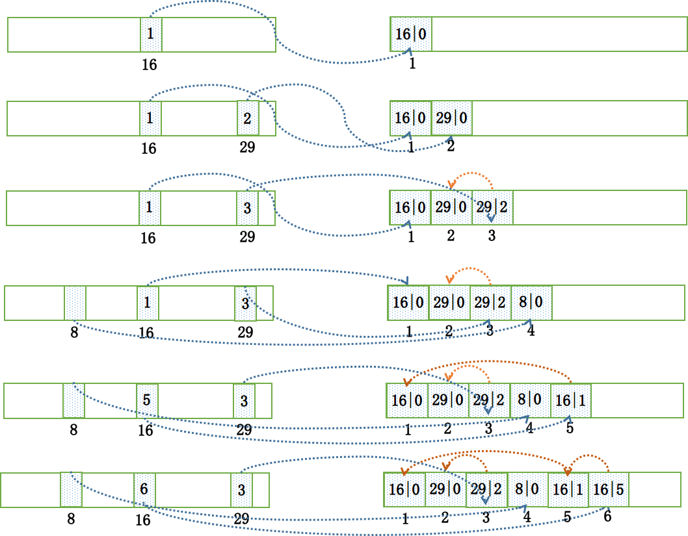

# RocketMQ
- 核心组件
    - consumer
    > 推和拉消费模式，支持集群消费，广播消息  
    - producer
    > 与nameserver服务无心跳，和broker有 30s一次的心跳
    - nameserver
    > 主要负责对于源数据的管理，包括了对于topic和路由信息的管理  
    > 类似zk 更加轻量级。每个节点之间是独立，没有交互    
    > 每个节点都有完整的路由信息  无状态节点   
    > 两大功能 broker管理 路由管理  
    - broker
    > 消息中转角色，负责存储消息，转发消息  
    > broker是具体提供业务的服务器，单个broker节点与所有的nameserver节点保持长连接和心跳，定时注册topic信息到nameserver，基于netty实现  注册的时候，需要向每一个nameserver去注册
    > 负责消息存储 以topic为维度支持轻量级的队列，单机支持上万队列
    > remoting modulebroker 实体 处理clients端请求
    > client manager 负责管理客户端 和维护topic的订阅情况
    > store service 提供简单的api接口处理消息存储到物理磁盘和查询功能
    > HA Service 高可用提供master-slave之间的同步
    > index service 根据特定的message key 对投递到broker的消息进行索引服务，以提供消息的快速查询
- 容错
    - producer 1.nameserver缓存，防止nameserver宕机  2.选择broker的时候，根据失败情况进行避让， 
- 大致流程
    - broker启动会去nameserver注册，定时发送心跳，producer在启动时会到nameserver上拉取topic所属的broker地址，然后，向具体的broker发送消息
- 消息发送三种方式
    - 同步等待
    - 异步，等待回调
    - 单向，用作心跳
- 领域模型
    - message
    - topic
    > topic 表示消息的第一级类型，区分不同的消息，最细粒度的订阅单位，group可以订阅多个topic  tag用来二级类型
    - queue
    > 消息的物理管理单位 ，一个topic下可以有多个queue，提供了水品扩展的能力
    - offset
    - group
    > 订阅多个topic
- 特性
    - 顺序消息
    > 相同id的消息放到同一个队列，同一个队列的消息只能由一个消费者来消费  
    > 全局顺序 对于同一个topic，严格按照FIFO消息进行发布和消费
    > 分区顺序 对于一个topic，所有消息根据sharding key进区块分区，同一个分区内的消息按照严格的FIFO顺序来发布消费，shardingkey是消息中用来区分不同分区的字段，
    - 重复消息
    > Qos(服务质量)定义  最多一次 至少一次 仅一次  
    > 1. 业务保证幂等性  
    > 2. 去重策略  保证每条信息都有唯一的流水号
    - 消息可靠性
    > 消息持久化，主从同步，保证可靠性
    - 回溯消费 如果消息需要重新消费，消息会保留，等待下次消费
    - 事务消息
    - 定时消息
    - 消息重试
- 存储
    - 单个broker下所有对立共用一个日志数据文件(commitlog)  针对producer和consumer分别采用了数据和索引部分相分离的存储结构
    - 页缓存是OS对文件的缓存，用于加速文件的读写，一般来说，文件顺序读写速度接近内存读取速度，主要原因是OS使用page cache对读写访问操作进行了性能优化，将一部分的内存用作page cache，对于数据的写入，OS会先写入到cache内，然后异步方式通过内核线程写道物理磁盘上。 对于数据的读取，如果一次读取文件时出现未命中pagecache的情况，会顺序对其他相邻块的数据预读取   
    另外Mmap的方式，减少了内存和磁盘写入映射的时间
    - 刷盘  
        - 同步刷盘
        > 消息持久化到磁盘，才给producer一个ack，可靠性高
        - 异步刷盘
        > 写入pagecache就ack，性能高
    - 也就是说每个Topic在Broker上会划分成几个逻辑队列，每个逻辑队列保存一部分消息数据，
        但是保存的消息数据实际上不是真正的消息数据，而是指向commit log的消息索引。
        Queue不是真正存储Message的地方，真正存储Message的地方是在CommitLog 每次消费记录的也是当前消费消息的offset
    - RocketMQ主要通过MappedByteBuffer对文件进行读写操作。
    其中，利用了NIO中的FileChannel模型将磁盘上的物理文件直接映射到用户态的内存地址中
    （这种Mmap的方式减少了传统IO将磁盘文件数据在操作系统内核地址空间的缓冲区和用户应用程序地址空间的缓冲区之间来回进行拷贝的性能开销），
    将对文件的操作转化为直接对内存地址进行操作，从而极大地提高了文件的读写效率
    （正因为需要使用内存映射机制，故RocketMQ的文件存储都使用定长结构来存储，方便一次将整个文件映射至内存）。

    - 文件预分配和文件预热
    而内存映射也只是做了映射，只有当真正读取页面的时候产生缺页中断，才会将数据真正加载到内存中，所以 RocketMQ 做了一些优化，防止运行时的性能抖动。
    文件预分配
    CommitLog 的大小默认是1G，当超过大小限制的时候需要准备新的文件，而 RocketMQ 就起了一个后台线程 AllocateMappedFileService，不断的处理 AllocateRequest，  AllocateRequest 其实就是预分配的请求，会提前准备好下一个文件的分配，防止在消息写入的过程中分配文件，产生抖动。
    文件预热
    有一个 warmMappedFile 方法，它会把当前映射的文件，每一页遍历多去，写入一个0字节，然后再调用mlock 和 madvise(MADV_WILLNEED)。
    mlock：可以将进程使用的部分或者全部的地址空间锁定在物理内存中，防止其被交换到 swap 空间。
    madvise：给操作系统建议，说这文件在不久的将来要访问的，因此，提前读几页可能是个好主意。
- 通信
    - borker启动后需要把自己注册到nameserver，之后每隔30s定时提交topic信息
    - producer作为客户端发送消息时，需要根据消息的topic从本地缓存的topicpublishinfotable获取路由信息，如果没有则更新路由信息，从nameserver上重新拉取，默认30s去更新一次
    - producer根据nameserver拿到的路由信息，选择一个队列发送消息，broker接收消息，落盘
    - consumer 根据nameserver中的路由信息，负载均衡后，选择一个或几个队列拉取消息消费
- 负载均衡
    - producer端在发送消息时，会先根据topic找到指定的TopicPublishInfo，然后会在queuelist中选择一个队列，默认是随机递增取模对应的哪个队列，如果开启了sendLatencyFaultEnable。会对之前失败的broker做一定时间的退避
    - consumer启动后，会不断向所有的broker发送心跳包，broker收到后，将关系维护在本地
    - 启动后，调用rebalance()根据广播还是集群，不同的负载均衡策略
        - 从rebalanceimpl的本地缓存topicsubscribeinfotable 获取topic下消息消费队列集合， 根据topic和consumegroup去broker获取消费队列
- 事务消息
    - 暂时不能被 Consumer消费的消息。Producer已经把消息发送到 Broker端，但是此消息的状态被标记为不能投递，处于这种状态下的消息称为半消息。事实上，该状态下的消息会被放在一个叫做 RMQ_SYS_TRANS_HALF_TOPIC的主题下。 
    - 当 Producer端对它二次确认后，也就是 Commit之后，Consumer端才可以消费到；那么如果是Rollback，该消息则会被删除，永远不会被消费到。 
    - 对没有commit rollback的消息，从broker进行一次回查(最多15次，否则回滚)， producer收到回查消息，检查回查消息对应的本地事务状态，根据本地事务状态，重新commit或rollback
    - 引入op消息，区别这条事务消息，是否已经确定状态，如果一条消息没有对应的op消息，说明事务状态没确定。引入op消息，事务消息不管是commit还是rollback都会记录一个op操作，commit相对rollback只是在写入op消息前创建half消息的索引
- 死信队列
    - 当一条消息初次消费失败，消息队列RocketMQ版会自动进行消息重试，达到最大重试次数后，若消费依然失败，则表明消费者在正常情况下无法正确地消费该消息。此时，消息队列RocketMQ版不会立刻将消息丢弃，而是将其发送到该消费者对应的特殊队列中。 在消息队列RocketMQ版中，这种正常情况下无法被消费的消息称为死信消息（Dead-Letter Message），存储死信消息的特殊队列称为死信队列（Dead-Letter Queue）。
    - 死信队列不会被正常消费者消费，只存储3天
    - 一个死信消息对应一个groupId，而不是一个consumer
    - 如果一个group id没产生过死信队列，mq不会为其创造对应的死信队列
    - 一个死信队列包含对应groupId的对应所有的死信消息，不论是哪一个topic
- 最佳实践
    -  最好一个应用一个topic，子消息通过tag区分
    - 消费太慢
        -  增加并行消费能力
        - 批量消费
        - 跳过不重要的消息 如果消费速度一直追不上发送速度，如果业务对数据要求不高的话，可以选择丢弃不重要的消息。例如，当某个队列的消息数堆积到100000条以上，则尝试丢弃部分或全部消息，这样就可以快速追上发送消息的速度。
        - 优化每条消息消费流程，比如中间涉及到比较慢的存储设备，就先存储到快的存储设备上

- messagequeue
    - 一个topic有多个messagequeue，每个broker分布多个queue，生产者通过balance来分发到不同的broker的queue上

## 消息丢失
- 生产者丢失
生产者丢失消息的可能点在于程序发送失败抛异常了没有重试处理，或者发送的过程成功但是过程中网络闪断MQ没收到，消息就丢失了。
使用同步发送会有结果返回 ，异步会有发送完成的回调，但是oneway就不保证成功发送了

由于同步发送的一般不会出现这样使用方式，所以我们就不考虑同步发送的问题，我们基于异步发送的场景来说。

异步发送分为两个方式：异步有回调和异步无回调，无回调的方式，生产者发送完后不管结果可能就会造成消息丢失，而通过异步发送+回调通知+本地消息表的形式我们就可以做出一个解决方案。以下单的场景举例。

下单后先保存本地数据和MQ消息表，这时候消息的状态是发送中，如果本地事务失败，那么下单失败，事务回滚。
下单成功，直接返回客户端成功，异步发送MQ消息
MQ回调通知消息发送结果，对应更新数据库MQ发送状态
JOB轮询超过一定时间（时间根据业务配置）还未发送成功的消息去重试
在监控平台配置或者JOB程序处理超过一定次数一直发送不成功的消息，告警，人工介入。

多个broker ，如果发送失败了，会选择下一个broker重试

总结： 重试 同步发送 多master broker

- MQ丢失
如果生产者保证消息发送到MQ，而MQ收到消息后还在内存中，这时候宕机了又没来得及同步给从节点，就有可能导致消息丢失。

比如RocketMQ：

RocketMQ分为同步刷盘和异步刷盘两种方式，默认的是异步刷盘，就有可能导致消息还未刷到硬盘上就丢失了，可以通过设置为同步刷盘的方式来保证消息可靠性，这样即使MQ挂了，恢复的时候也可以从磁盘中去恢复消息。
虽然我们可以通过配置的方式来达到MQ本身高可用的目的，但是都对性能有损耗，怎样配置需要根据业务做出权衡。

- 消费者丢失
消费者丢失消息的场景：消费者刚收到消息，此时服务器宕机，MQ认为消费者已经消费，不会重复发送消息，消息丢失。

RocketMQ默认是需要消费者回复ack确认，而kafka需要手动开启配置关闭自动offset。

消费方不返回ack确认，重发的机制根据MQ类型的不同发送时间间隔、次数都不尽相同，如果重试超过次数之后会进入死信队列，需要手工来处理了。（Kafka没有这些）

## 消息积压
- 通过以上客户端消费原理可以看出消息拉取和本地消费，消息堆积的主要瓶颈在于本地客户端的消费能力，即消费耗时和消费并发度。想要避免和解决消息堆积问题，必须合理的控制消费耗时和消息并发度，其中消费耗时的优先级高于消费并发度，必须先保证消费耗时的合理性，再考虑消费并发度问题。

- 你说到消费者消费失败的问题，那么如果一直消费失败导致消息积压怎么处理？
因为考虑到时消费者消费一直出错的问题，那么我们可以从以下几个角度来考虑：

消费者出错，肯定是程序或者其他问题导致的，如果容易修复，先把问题修复，让consumer恢复正常消费
如果时间来不及处理很麻烦，做转发处理，写一个临时的consumer消费方案，先把消息消费，然后再转发到一个新的topic和MQ资源，这个新的topic的机器资源单独申请，要能承载住当前积压的消息
处理完积压数据后，修复consumer，去消费新的MQ和现有的MQ数据，新MQ消费完成后恢复原状
  ### 过期消息
    检查这个文件最后访问时间
    判断是否大于过期时间
    指定时间删除，默认凌晨4点


## 架构与原理
- RocketMQ由NameServer注册中心集群、Producer生产者集群、Consumer消费者集群和若干Broker（RocketMQ进程）组成，它的架构原理是这样的：

Broker在启动的时候去向所有的NameServer注册，并保持长连接，每30s发送一次心跳
Producer在发送消息的时候从NameServer获取Broker服务器地址，根据负载均衡算法选择一台服务器来发送消息
Conusmer消费消息的时候同样从NameServer获取Broker地址，然后主动拉取消息来消费

- 为什么RocketMQ不使用Zookeeper作为注册中心呢？
我认为有以下几个点是不使用zookeeper的原因：

根据CAP理论，同时最多只能满足两个点，而zookeeper满足的是CP，也就是说zookeeper并不能保证服务的可用性，zookeeper在进行选举的时候，整个选举的时间太长，期间整个集群都处于不可用的状态，而这对于一个注册中心来说肯定是不能接受的，作为服务发现来说就应该是为可用性而设计。
基于性能的考虑，NameServer本身的实现非常轻量，而且可以通过增加机器的方式水平扩展，增加集群的抗压能力，而zookeeper的写是不可扩展的，而zookeeper要解决这个问题只能通过划分领域，划分多个zookeeper集群来解决，首先操作起来太复杂，其次这样还是又违反了CAP中的A的设计，导致服务之间是不连通的。
持久化的机制来带的问题，ZooKeeper 的 ZAB 协议对每一个写请求，会在每个 ZooKeeper 节点上保持写一个事务日志，同时再加上定期的将内存数据镜像（Snapshot）到磁盘来保证数据的一致性和持久性，而对于一个简单的服务发现的场景来说，这其实没有太大的必要，这个实现方案太重了。而且本身存储的数据应该是高度定制化的。
消息发送应该弱依赖注册中心，而RocketMQ的设计理念也正是基于此，生产者在第一次发送消息的时候从NameServer获取到Broker地址后缓存到本地，如果NameServer整个集群不可用，短时间内对于生产者和消费者并不会产生太大影响。

- 那Broker是怎么保存数据的呢？
RocketMQ主要的存储文件包括commitlog文件、consumequeue文件、indexfile文件。

Broker在收到消息之后，会把消息保存到commitlog的文件当中，而同时在分布式的存储当中，每个broker都会保存一部分topic的数据，同时，每个topic对应的messagequeue下都会生成consumequeue文件用于保存commitlog的物理位置偏移量offset，indexfile中会保存key和offset的对应关系。

- Master和Slave之间是怎么同步数据的呢？
而消息在master和slave之间的同步是根据raft协议来进行的：

在broker收到消息后，会被标记为uncommitted状态
然后会把消息发送给所有的slave
slave在收到消息之后返回ack响应给master
master在收到超过半数的ack之后，把消息标记为committed
发送committed消息给所有slave，slave也修改状态为committed


- 为什么快 是因为使用了顺序存储、Page Cache和异步刷盘。

我们在写入commitlog的时候是顺序写入的，这样比随机写入的性能就会提高很多
写入commitlog的时候并不是直接写入磁盘，而是先写入操作系统的PageCache
最后由操作系统异步将缓存中的数据刷到磁盘

## 事务消息

- 什么是事务、半事务消息？怎么实现的？
事务消息就是MQ提供的类似XA的分布式事务能力，通过事务消息可以达到分布式事务的最终一致性。

半事务消息就是MQ收到了生产者的消息，但是没有收到二次确认，不能投递的消息。

实现原理如下：

生产者先发送一条半事务消息到MQ
MQ收到消息后返回ack确认
生产者开始执行本地事务
如果事务执行成功发送commit到MQ，失败发送rollback
如果MQ长时间未收到生产者的二次确认commit或者rollback，MQ对生产者发起消息回查
生产者查询事务执行最终状态
根据查询事务状态再次提交二次确认
最终，如果MQ收到二次确认commit，就可以把消息投递给消费者，反之如果是rollback，消息会保存下来并且在3天后被删除。

- RocketMQ 高可用
       RocketMQ 进程我们一般称为 Broker，Broker 通常是集群部署的，每个 Broker 需要注册到 NameServer 中。从这里我们可以知道高可用有两个地方需要解决，一是 Broker 挂了怎么办，二是 NameServer 挂了怎么办。

       对于 NameServer，它的高可用保障是集群化部署，各个 NameServer 之间互不通信，每个 NameServer 都有一份完整的 Broker 路由信息。当某一个 NameServer 挂掉后，对集群没有任何影响，只要还有一个 NameServer 存活，就能提供完整的服务。

       对于 Broker，它高可用保障是主从架构和多副本策略。Broker 有 Master 和 Slave 两种角色，Master 和 Salve 上的数据是一模一样的，Master Broker 收到消息后会同步给 Slave Broker。每个 Master Broker 和 Slave Broker 都会向所有 NameServer 注册。Master 宕机了，会重新选举一个 Slave 作为 Master 继续提供写服务，对读服务无影响，每个 Slave 都可以读但是不可以写；Slave 宕机了，对服务无影响。

## 读写分离

- RocketMq实现了读写分离了吗
生产者发送一条消息到Master Broker之后，这条消息也会同步给Slave Broker，那么当消费者要消费消息的时候是从Master中拿消息还是从Slave拿消息呢？？

其实都有可能，主要还是要根据Master Broker的情况来定，作为消费者首先会从Master Broker去获取消息，此时Master Broker会返回一批消息给消费者，在Master broker返回消息给消费者的同时，会根据Master Broker本身的负载情况和Slave Broker的同步情况，向消费者建议下次是从Master Broker拿消息还是从Slave Broker拿消息。

比如：Master Broker现在要接收很多生产者发送过来的消息，那么Master Broker本身的负载就已经很大了，如果还从Master Broker拿消息吗，那么只会让Master Broker的压力更大，所以Master Broker会建议消费者下次从Slave Broker拿消息

如果Master Broker现在有10万条数据，但是Slave Broker只同步了90万条，这时候还有10万条数据没有同步，那么这时候消费者还是会直接从Master Broker拿数据

- slave是自己定时去master拉消息的


- 系统如何从NameS而ver获取Broker信息
  系统主动去NameServer获取最新的Broker信息，每个系统都会定时的发送请求去NameServer拉取最新的Broker的信息，不管是生产者还是消费者，都会每隔一段时间就去NameServer拉取最新的Broker信息

- NameServer如何感知Broker挂掉了
如果某一个Broker挂掉了，那么NameServer是如何感知的呢？？
其实每个Broker都会每隔30s就会向所有的NameServer发送一次心跳，并且NameServer本身也会每隔10s就会去查一下是否有哪一个Broker 120s了还没有发送心跳，如果120s都没有发过心跳了，那就认为这个Broker已经挂了


## 负载均衡

- 负载均衡
> producer 负载均衡
producer端
发送端指定message queue发送消息到相应的broker，来达到写入时的负载均衡
提升写入吞吐量，当多个producer同时向一个broker写入数据的时候，性能会下降
消息分布在多broker中，为负载消费做准备
默认策略是随机选择：
    producer维护一个index
    每次取节点会自增
    index向所有broker个数取余
    自带容错策略
其他实现：
    SelectMessageQueueByHash
    hash的是传入的args
    SelectMessageQueueByRandom
    SelectMessageQueueByMachineRoom 没有实现
    也可以自定义实现MessageQueueSelector接口中的select方法
> Broker负载均衡
Broker是以group为单位提供服务。一个group里面分master和slave,master和slave存储的数据一样，slave从master同步数据（同步双写或异步复制看配置）。

通过nameserver暴露给客户端后，只是客户端关心（注册或发送）一个个的topic路由信息。路由信息中会细化为message queue的路由信息。而message queue会分布在不同的broker group。所以对于客户端来说，分布在不同broker group的message queue为成为一个服务集群，但客户端会把请求分摊到不同的queue。

而由于压力分摊到了不同的queue,不同的queue实际上分布在不同的Broker group，也就是说压力会分摊到不同的broker进程，这样消息的存储和转发均起到了负载均衡的作用。

Broker一旦需要横向扩展，只需要增加broker group，然后把对应的topic建上，客户端的message queue集合即会变大，这样对于broker的负载则由更多的broker group来进行分担。
并且由于每个group下面的topic的配置都是独立的，也就说可以让group1下面的那个topic的queue数量是4，其他group下的topic queue数量是2，这样group1则得到更大的负载。
> consumer负载均衡  https://juejin.cn/post/6854573222420037639
    - 一个queue只能有一个consumer，防止重复消费
    - 如果consumer>queues 就会有consumer不进行消费
    - 广播的话，就是所有consumer接收到所有queue
    - AllocateMessageQueueAveragely: 平均分配。
AllocateMessageQueueAveragelyByCircle: 平均轮询分配
AllocateMessageQueueConsistentHash: 一致性hash
AllocateMessageQueueByConfig: 根据配置，为每一个消费者配置固定的消息队列。
AllocateMessageQueueByMachineRoom: 根据Broker部署机房名，对每个消费者负责不同的Broker上的队列。


##  选型
- mq选型
    - activemq社区活跃度低，版本旧，高并发下性能不够
    - rabbit 消息堆积情况下会影响性能，而且基于erlang开发，二次开发成本大
    - kafaka 功能不够晚上，性能高，适合做日志采集

## 推 拉消息
- 两种消费模式 pull 和 push 但push底层也是通过pull来实现的
- 为什么要主动拉取消息而不使用事件监听方式？
事件驱动方式是建立好长连接，由事件（发送数据）的方式来实时推送。
如果broker主动推送消息的话有可能push速度快，消费速度慢的情况，那么就会造成消息在consumer端堆积过多，同时又不能被其他consumer消费的情况。
而pull的方式可以根据当前自身情况来pull，不会造成过多的压力而造成瓶颈。所以采取了pull的方式。

- broker如何处理拉取请求的？
Consumer首次请求Broker
Broker中是否有符合条件的消息
    有 ->
        响应Consumer
        等待下次Consumer的请求
    没有
        DefaultMessageStore#ReputMessageService#run方法
        PullRequestHoldService 来Hold连接，每个5s执行一次检查pullRequestTable有没有消息，有的话立即推送
        每隔1ms检查commitLog中是否有新消息，有的话写入到pullRequestTable
        当有新消息的时候返回请求
        挂起consumer的请求，即不断开连接，也不返回数据
        使用consumer的offset，

## 如何实现一个消息系统
- 16、如果让你来动手实现一个分布式消息中间件，整体架构你会如何设计实现?
    需要考虑能快速扩容、天然支持集群
    持久化的姿势
    高可用性
    数据0丢失的考虑
    服务端部署简单、client端使用简单

## 消息发送结果
- ​消息发送成功或者失败要打印消息日志，务必要打印SendResult和key字段。send消息方法只要不抛异常，就代表发送成功。发送成功会有多个状态，在sendResult里定义。以下对每个状态进行说明：

SEND_OK
消息发送成功。要注意的是消息发送成功也不意味着它是可靠的。要确保不会丢失任何消息，还应启用同步Master服务器或同步刷盘，即SYNC_MASTER或SYNC_FLUSH。

FLUSH_DISK_TIMEOUT
消息发送成功但是服务器刷盘超时。此时消息已经进入服务器队列（内存），只有服务器宕机，消息才会丢失。消息存储配置参数中可以设置刷盘方式和同步刷盘时间长度，如果Broker服务器设置了刷盘方式为同步刷盘，即FlushDiskType=SYNC_FLUSH（默认为异步刷盘方式），当Broker服务器未在同步刷盘时间内（默认为5s）完成刷盘，则将返回该状态——刷盘超时。

FLUSH_SLAVE_TIMEOUT
消息发送成功，但是服务器同步到Slave时超时。此时消息已经进入服务器队列，只有服务器宕机，消息才会丢失。如果Broker服务器的角色是同步Master，即SYNC_MASTER（默认是异步Master即ASYNC_MASTER），并且从Broker服务器未在同步刷盘时间（默认为5秒）内完成与主服务器的同步，则将返回该状态——数据同步到Slave服务器超时。

SLAVE_NOT_AVAILABLE
消息发送成功，但是此时Slave不可用。如果Broker服务器的角色是同步Master，即SYNC_MASTER（默认是异步Master服务器即ASYNC_MASTER），但没有配置slave Broker服务器，则将返回该状态——无Slave服务器可用。


## 消息索引

-  当有新的消息过来后，构建索引服务会取出这条消息的键，然后对字符串 “话题#键” 构建索引。构建索引的步骤如下:

找出哈希槽: 生成字符串哈希码，取余落到 500W 个槽位之一，并取出其中的值，默认为 0
找出索引槽: IndexHeader 维护了 indexCount，实际存储的索引槽就是直接依次顺延添加的
存储索引内容: 找到索引槽后，放入键哈希值、存储偏移量、存储时间戳与下一个索引槽地址。下一个索引槽地址就是第一步哈希槽中取出的值，0 代表这个槽位是第一次被索引，而不为 0 代表这个槽位之前的索引槽地址。由此，通过索引槽地址可以将相同哈希槽的消息串联起来，像单链表那样。
更新哈希槽: 更新原有哈希槽中存储的值
我们以实际例子来说明。假设我们需要依次为键的哈希值为 “{16,29,29,8,16,16}” 这几条消息构建索引，我们在这个地方忽略了索引信息中存储的存储时间和偏移量字段，只是存储键哈希和下一索引槽信息，那么:
```
放入 16: 将 “16|0” 存储在第 1 个索引槽中，并更新哈希槽为 16 的值为 1，即哈希槽为 16 的第一个索引块的地址为 1  
放入 29: 将 “29|0” 存储在第 2 个索引槽中，并更新哈希槽为 29 的值为 2，即哈希槽为 29 的第一个索引块的地址为 2  
放入 29: 取出哈希槽为 29 中的值 2，然后将 “29|2” 存储在第 3 个索引槽中，并更新哈希槽为 29 的值为 3，即哈希槽为 29 的第一个索引块的地址为 3。而在找到索引块为 3 的索引信息后，又能取出上一个索引块的地址 2，构成链表为： “[29]->3->2”  
放入 8: 将 “8|0” 存储在第 4 个索引槽中，并更新哈希槽为 8 的值为 4，即哈希槽为 8 的第一个索引块的地址为 4  
放入 16: 取出哈希槽为 16 中的值 1，然后将 “16|1” 存储在第 5 个索引槽中，并更新哈希槽为 16 的值为 5。构成链表为: “[16]->5->1”  
放入 16: 取出哈希槽为 16 中的值 5，然后将 “16|5” 存储在第 6 个索引槽中，并更新哈希槽为 16 的值为 6。构成链表为: “[16]->6->5->1”     
``` 
    

