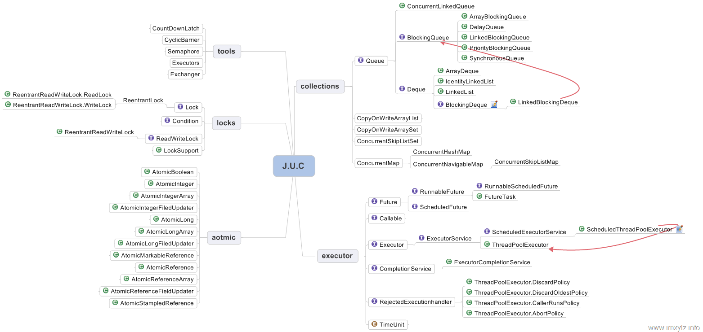

# 并发编程


### 多线程创建
- Thread
- Runnable
- Callable
#### 锁
- synchroized
  可以修饰
  - 方法
  - 对象
  - 类
  - 静态方法
  方法和对象锁住对象锁
  类和静态方法段获得类锁
- Lock
- Reentrant
- ReentrantReadWriteLock
- StampedLock
- AbstractQueuedSynchronizer(AQS)

| 12 | 121 | sds |  
|:-- |:-- | :--|  
| 12 | 121 | sds |  
| 12 | 121 | sds |  
| 12 | 121 | sds |  
#### J.U.C
- atmoic
- locks
- collections
- Executor
  - ForkJoin
  - ThreadPoolExecutor
  - Executors
- sync
#### 并发的三个核心
- 分工
- 合并 
- 互斥  
  + 原子性  
    * 加锁
  + 有序性  
    * 编译器优化顺序影响有序性
      >
  + 可见性  
    * JMM  
      > 这里引入了JMM(Java Memeory Model) java内存模型，这个模型规定 变量都是放在主内存里面，线程修改的时候，要copy一个副本，这个副本修改完成后，刷新回主内存  
      >> 这里引入了一个并发问题，就是A拿走了，改了数据，B拿到的是没会写前的数据，这样就会发生可见性问题  
      >>>Happens-Before  
      >>>第一个操作的结果，对第二个数据可见
      >>>>程序顺序性规则  
      >>>>volatile变量规则  
      >>>>传递性规则  
      >>>>监视器锁规则  
      >>>>start()规则  
      >>>>join()规则  

      >> 内存屏障保护实现有序性，防止重排序
      >>> volatile写前插入一个storestore屏障
      >>> volatile写后插入一个storeLoad屏障`
      >>> volatile读前插入一个loadLoad屏障
      >>> volatile读后插入一个loadStore屏障
      >>>写一个volatile变量，实际上是向其他要读这个变量的线程发消息，让他们去主内存读
  + synchroized 只能保护当前对象，无法保护目标对象，这时候就需要锁整个class
    > 锁 普通同步方法,锁的是当前实例对象  静态方法,锁整个class   同步代码块，锁括号里面的obj
    
  + volatile 不保障原子性，所以写入值不依赖原址时，可以使用
  + 死锁
    - 条件
      >互斥  这个资源，只有唯一线程占用，排斥其他线程的占用  
      >请求和保持条件 持有一个资源，同时请求下一个资源，该资源已被其他线程持有  
      >不可剥夺条件 不使用完，不释放   
      >环路等待 必然存在进程，资源，环形链，所需的资源必然画成一个环  
      
      >> 可以尝试破坏 后三个条件
  + 等待/唤醒   
    + 管程
    > 管理共享变量以及对共享变量的操作，让他们支持并发
    >>数据和操作，一起入列enq 出列deq，多线程执行只能通过队列排队执行，入列出列，本身是互斥的
    > 通过另外的变量，来保证资源由同一线程持有
    ```
    sychroized() {
      while(m) {
        obj.wait
      }
    }

    sychroized() {
      while(m) {
        obj.notyfy()
      }
    }

    ```
 
    + MESA模型
    > 

    + 线程的生命周期
    > 操作系统
    ```
      初始
      可运行
      运行中
      阻断
      结束
     ```
    > jvm 
    ```
      NEW
      RUNNABLE
      BLOCKED
      WAITING
      TIME_WAITING
      TERMINATED
    ```
  + 中断 
    > Thread.interrupt() 中断自己或者其他线程，底层依赖native方法 
    >> 当线程在wait join sleep 被中断，会抛出InterruptException异常

    > Thread.isInterrupted() 判断线程是否中断 

    > Thread.interrupted() 清空中断标识，只有当前存在中断标志，才会返回true，否则返回false

    > 原则
    >> 如果遇到的是可中断的阻塞方法, 并抛出 InterruptedException，可以继续向方法调用栈的上层抛出该异常；如果检测到中断，则可清除中断状态并抛出 InterruptedException，使当前方法也成为一个可中断的方法

    >> 若有时候不太方便在方法上抛出 InterruptedException，比如要实现的某个接口中的方法签名上没有 throws InterruptedException，这时就可以捕获可中断方法的 InterruptedException 并通过 Thread.currentThread.interrupt() 来重新设置中断状态。

### Lock锁 
  - 因为synchronized不能及时退出锁，控制锁的状态  
  - 新的接口 
    - lock()  
    > 加锁
    - tryLock() 
    > 尝试加锁
    - lockInterruptibly()
    > 响应中断加锁 
    - tryLock() 
    > 带超时的尝试加锁 
    - unLock()
    > 解锁 
    - newCondition()
    > 等待条件 
  - 标准 
     +  finanlly 释放锁 
    +  try 前获取锁 
  - 子类通过AQS(AbstractQueuedSynchronizer)队列来获取锁  
    - AQS作为抽象类，也是一个模板方法
    - 可重写的方法  
        - tryAcquire 独占获取锁
        - tryRelease 独占释放锁
        - tryAcquire 共享获取锁
        - tryReleaseShared 共享释放锁
        - isHeldExclusively 当前同步器是否在独占模式下被线程使用，一半用来表示是否被当前线程占用
    - 公共方法 用来设置同步状态
        - setState()
        - getState()
        - compareAndSetState() 
    - 主流程入口 
        - acquire()
        - acquireInterruptibly()
        - tryAcquireNanos()
        - release()
        - acquireShared()
        - acquireSharedInterruptibly()
        - tryAcquireSharedNanos()
        - releaseShared() 
    - lock()接口
      - 使用 成员变量 sync(AQS).lock()
      - NonFair 
          - CAS state = 1
              -  成功，设置当前线程为持有锁的线程
              -  失败 进入AQS获取锁
                  - trAcquire 尝试获取锁一次
                      - (子类实现)
                      - state == 0 没人获取锁
                          - CAS state = acquires 成功
                          - 设置当前线程为占有线程
                      - 如果当前线程已拥有锁
                          - 占锁数量 + accquires
                          - 成功
                      - 否则尝试失败
                    - 成功，直接返回
                    - 失败 进入队列
                  - addWaiter 
                    - 新建当前线程节点
                    - 如果tail(尾节点) 不为空
                      - 当前节点的前继 设置为tail
                      - CAS当前节点为tail
                        - 成功 之前的tail.next = 当前节点 结束addWaiter
                    - enq(node) 节点入队 此时 当前节点的前继可能已经是上次获取的tail了
                      - 死循环 
                        - 检查此时tail是否为空
                          - 是 CAS一个空节点作为HEAD tail = head
                          - 否 当前节点的前继转移到这个tail上 然后CAS当前为tail tail.next = 当前Node 退出循环
                  - acquireQueued
                    - 标志位 failed = true ，finally用到
                    - 标志位 interrupted = false;
                    - 死循环 
                      - 获取当前节点的前继 pred
                      - 如果前驱是 head 并且 tryAcquire成功 
                        - 设置当前节点为head
                        - 设置标志位，退出acquireQueued 此时抢锁成功
                      - 如果第一次没抢成锁
                        - shouldParkAfterFailedAcquire 是否需要中断
                          - 如果前驱是SIGNAL，那就需要中断了
                          - 如果前驱是 > 0 说明取消了 
                            - 往前找，找到最后一个不为取消的节点作为前驱 互相连接 并不需要中断，再进行一次循环 
                          - 如果不是SIGNAL 是 CONDITION PROPAGATE之类的, 设置为SIGNAL 再来一次循环 这时候前驱是SIGNAL，就会中断当前线程
                          - 目的是找到一个靠谱的前驱，然后中断自己或者抢到锁
                        - 需要中断的话 parkAndCheckInterrupt 
                          - unsafe.park 中断自己
                          - 被唤醒后返回中断状态
                        - 如果中断过，就设置标志位 interrupted = true;  
                    - finally
                      - 如果发生了异常 （应该发生在抢锁的过程上）
                        - cancelAcquire
                          - null检查
                          - node.thread = null
                          - 找到不是cancel的前驱 定位它的后继
                          - 设置当前节点为CANCEL
                          - 当前节点是 tail
                            - 前驱设置为tail
                          - 前驱不是head && （前驱是signal || （前驱的状态不是canceled 并且设置前驱为signal成功）） && 前驱线程不为空
                            - CAS 后继节点连给前驱 pred.next = node.next
                          - 前驱是HEAD
                            - unparkSuccessor 唤醒节点
                              - 设置当前节点为CANCEL
                              - 当前节点的后继如果存在 || 或者为取消状态
                              - 从tail往前找，找到一个可用的节点（SIGNAL） (因为入队先设置的是prev， 取消也是先放 next)
                              - 接触那个节点的中断
    - release()接口
      - tryRelease()  (子类实现)                
        - 判断释放的状态是否够多 判断当前线程和持有锁的线程是否一致
        - 是否只释放一个锁，释放成功就成功了
      - 看看head是否可用，可用走入  unparkSuccessor 唤醒head的所有后继 
    - lockInterruptibly() 响应中断获取锁
      - sync.lockInterruptibly
        - 如果当前线程已中断，放弃
        - tryAcquire
        - 如果tryAcquire失败
          - doAcquireInterruptibly
            -逻辑同acquire
              - 但是如果当前线程需要中断，中断，但是唤醒后，抛出异常
    - tryLock(timeout, unit) 带超时去尝试锁
      - sync.tryAcquireNanos
        - 如果当前线程已中断，放弃
        - tryAcquire
        - 如果tryAcquire失败
          - doAcquireNanos
            -逻辑同acquire
              - 但是如果当前线程需要中断，判断抢占锁是否超时，超时就失败了，否则只中断一段时间
    - Lock.newCondition()
    ```
    不同的线程，等待条件不同，此时就依赖不同的Condition
    class BoundedBuffer {
    final Lock lock = new ReentrantLock();
    final Condition notFull = lock.newCondition();
    final Condition notEmpty = lock.newCondition();

    final Object[] items = new Object[100];
    int putptr, takeptr, count;

    // 生产者方法，往数组里面写数据
    public void put(Object x) throws InterruptedException {
        lock.lock();
        try {
            while (count == items.length)
                notFull.await(); //数组已满，没有空间时，挂起等待，直到数组“非满”（notFull）
            items[putptr] = x;
            if (++putptr == items.length) putptr = 0;
            ++count;
            // 因为放入了一个数据，数组肯定不是空的了
            // 此时唤醒等待这notEmpty条件上的线程
            notEmpty.signal(); 
        } finally {
            lock.unlock();
        }
    }

    // 消费者方法，从数组里面拿数据
    public Object take() throws InterruptedException {
        lock.lock();
        try {
            while (count == 0)
                notEmpty.await(); // 数组是空的，没有数据可拿时，挂起等待，直到数组非空（notEmpty）
            Object x = items[takeptr];
            if (++takeptr == items.length) takeptr = 0;
            --count;
            // 因为拿出了一个数据，数组肯定不是满的了
            // 此时唤醒等待这notFull条件上的线程
            notFull.signal();
            return x;
        } finally {
            lock.unlock();
        }
    }}
    ```
      - sync.Condition();
        - AQS.ConditionObject();
          - await()
            - 当前节点包装入条件等待队列，唤醒前置，然后挂起自己
          - signal（）
            - 唤醒条件队列中的元素，进入等待队列
    - reebtrantLock 公平锁和非公平锁
      - 争夺锁的时候，判断下 是否已有节点在队里，如果有，不做抢占，直接入队
      - 节约cpu切换时间 减少节点判断  
    - 共享锁占用
      - 多个线程持有一个锁，但是锁可同时持有的线程数是有限的
      - acquireShared()
        -  addWaiter 创建shared节点入队
        - for 死循环获取锁
          - tryAcquireShared获取到锁，
            - setHeadAndPropagate
              - set当前节点为Head，然后设置propagate
                - propagate < 0 说明失败  > 0 成功且还有位置 ==0 独占最后一把锁
                - >0 通知队列中后面的线程
                ```
                                // 入参，node： 当前节点
                // 入参，propagate：获取同步状态的结果值，即上面方法中的变量 r
                private void setHeadAndPropagate(Node node, int propagate) {
                      // 记录旧的头部节点，用于下面的check
                      Node h = head; 
                      // 将当前节点设置为头节点
                      setHead(node);
                      
                      // 通过 propagate 的值和 waitStatus 的值来判断是否可以调用 doReleaseShared 方法
                      if (propagate > 0 || h == null || h.waitStatus < 0 ||
                          (h = head) == null || h.waitStatus < 0) {
                          Node s = node.next;
                          // 如果后继节点为空或者后继节点为共享类型，则进行唤醒后继节点
                          // 这里后继节点为空意思是只剩下当前头节点了，另外这里的 s == null 也是判断空指针的标准写法
                          if (s == null || s.isShared())
                              doReleaseShared();
                      }
                  }
                  private void doReleaseShared() {
                    /*
                    * Ensure that a release propagates, even if there are other
                    * in-progress acquires/releases.  This proceeds in the usual
                    * way of trying to unparkSuccessor of head if it needs
                    * signal. But if it does not, status is set to PROPAGATE to
                    * ensure that upon release, propagation continues.
                    * Additionally, we must loop in case a new node is added
                    * while we are doing this. Also, unlike other uses of
                    * unparkSuccessor, we need to know if CAS to reset status
                    * fails, if so rechecking.
                    */
                    for (;;) {
                        //找到head
                        Node h = head;
                        //如果 head 不空 != tail 意味着队列里还有其它节点
                        if (h != null && h != tail) {
                            int ws = h.waitStatus;
                            if (ws == Node.SIGNAL) {
                                //如果是激活的节点，去CAS设置下 设为0
                                if (!compareAndSetWaitStatus(h, Node.SIGNAL, 0))
                                    continue;            // loop to recheck cases
                                //唤醒后面的节点    
                                unparkSuccessor(h);
                            }
                            //如果已经是0，则设为propagate
                            else if (ws == 0 &&
                                    !compareAndSetWaitStatus(h, 0, Node.PROPAGATE))
                                continue;                // loop on failed CAS
                        }
                        if (h == head)                   // loop if head changed
                            break;
                    }
                }
                ```
            - 返回
          - 没拿到锁，进入park   shouldParkAfterFailedAcquire(p, node) && parkAndCheckInterrupt()
    - 实现 Semaphore 
      - 设置一个初始的state 作为信号量
    - ReadWriteLock
      - 读写锁规定
        - 多个线程同时读
        - 写锁只能一个线程
        - 写锁执行写操作，不允许读锁读数据
      - 读通过共享锁
      - 写通过独占锁
      - 考虑锁降级情况
      - state只有一个，所以按int的高16位和低16位来拆分 读状态放在高 16 位 ，写放在低16位
        - 写+1 直接+1  C & 0x0000FFFF
        - 读+1 c + 1<<16
        - c!=0 且 w = 0  r一定>0
          - 读在高位
      - 读锁获取的时候，如果队列的下一个节点为写锁，则暂时自旋，不获取锁，否则会饿死写锁
      - 不要尝试在两把读锁里面直接获取写锁，这样子并发读锁获取后，并发获取写锁，会出现死锁
      - 如果需要降级 则需要写锁释放前，获取读锁，保证获取的是本线程修改的数据
    - CountDownLatch
      - 等待一个标量一直被执行完成
    - CyclicBarrier
      - 循环屏障，完成一组数量后，重新开始屏障等待
      - 提供了一个回调入口，每一次完成屏障可以回调一次
      - await()
        - 带上lock锁
### CALLABLE和Future
- CallAble
  - 泛型，并且带返回值，可抛出异常
- Future
  - 多线程的返回内容
  - 提供获取线程状态和结果的接口
  - get()方法前不能被取消，否则有异常抛出
  - 实现类为 futureTask 
    - runnale 和 future接口
  ```
      /*
    *
    * Possible state transitions:
    * NEW -> COMPLETING -> NORMAL  //执行过程顺利完成
    * NEW -> COMPLETING -> EXCEPTIONAL //执行过程出现异常
    * NEW -> CANCELLED // 执行过程中被取消
    * NEW -> INTERRUPTING -> INTERRUPTED //执行过程中，线程被中断
    */
    private volatile int state;
    private static final int NEW          = 0;
    private static final int COMPLETING   = 1;
    private static final int NORMAL       = 2;
    private static final int EXCEPTIONAL  = 3;
    private static final int CANCELLED    = 4;
    private static final int INTERRUPTING = 5;
    private static final int INTERRUPTED  = 6;
  ```
    - 状态控制
    - get() 获取结果
      - 计算等待时间
      - 检查是否中断
      - 如果大于 COMPLETING 说明已经进入完成状态
        - 清空当前节点
      - COMPLETING的话，等一下
      - 如果当前节点没有对应Node，创建一个
      - 如果没有入队过，当前节点入栈
      - 超时是否存在
        - 不存在， park自己
        - 存在， 直接出栈，并且退出
      - 否则就park等待
    - run()
      - 调用callable
      - set() 设置返回
      - 唤醒栈中所有元素
  - CompletableFuture
    - 实现Future接口和CompletionStage，结合函数式接口，做多线程流程
    - 每次函数式接口的下一步，不一定是当前线程
    -  ForkJoinPool.commonPool()是用来实现的线程池，
    - 假设你有一组针对某个问题的solvers，每个都返回一个类型为Result的值，并且想要并发地运行它们，处理每个返回一个非空值的结果，在某些方法使用(Result r)
### 多线程队列
  - ArrayBlockingQueue
    -  基于数组的，有界队列，存在公平和非公平情况
  - LinkedBlockingQueue
    - 基于链表 有界队列，但是Integer.MAX太大了，会溢出
  - PriorityBlockingQueue
    - 支持有优先级的无界的阻塞队列
    - 插入元素后自动排序
  - DelayQueue
    - 支持延迟的阻塞式无界队列，每个元素要实现Delayed接口
  - SynchronousQueue
    - 一个不存储元素的阻塞队列
  - LinkedTransferQueue
    - 生产者用transfer传入元素，并阻塞，直到被取出
  - LinkedBlockingDeque
    - 双线链表阻塞队列